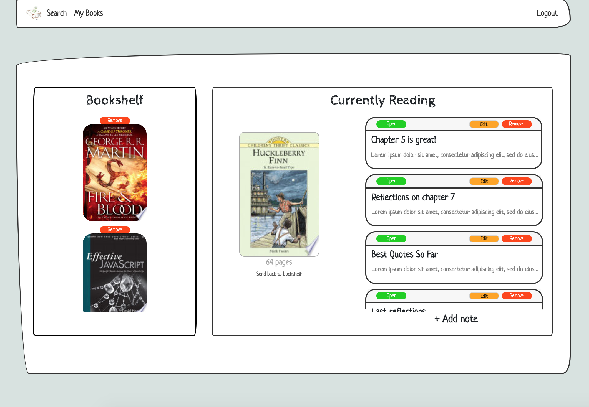

# Bookworm 

Bookworm full-stack web app using built with HTML5, CSS3, Bootstrap, Node.js, Express, Sequelize, and MySQL. It's aim is to allow users to keep their books, and any accompanying notes, in an authenticated account. 

## Getting Started

To access Bookworm, you may visit the [deployed](https://mysterious-meadow-98711.herokuapp.com/) version of the site or visit the [repo](https://github.com/nexio-t/project2).

## Demo

Need a place to store all your books? Want to take and keep book notes in a private account? Enter Booknote, a web app to conveniently search, store, and note-take on your favorite books. 

## Built With
* HTML5
* CSS3
* [Bootstrap](https://getbootstrap.com/)
* [MySQL](https://www.mysql.com/)
* [Sequelize](https://sequelize.org/)
* [Express](http://expressjs.com/)
* [Node.js](https://nodejs.org/en/) 
* [JavaScript](https://developer.mozilla.org/en-US/docs/Web/JavaScript) 
* [Passport](http://www.passportjs.org/) 
* [Adobe XD](https://www.adobe.com/products/xd/details.html) 

## Author

* **Tomas Gear** - *https://github.com/nexio-t*

